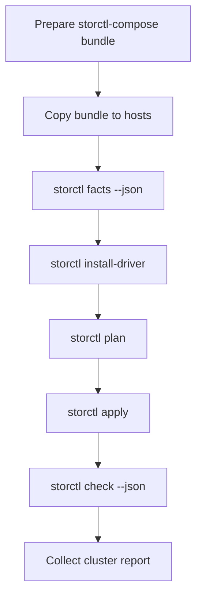

# storctl-compose

`storctl-compose` is the Ansible-based companion repository for [`storctl`](https://github.com/vbhsjd/storctl). It composes the `storctl` binary, profiles, driver manifests, offline artifact directories, and playbooks for batch NFS-RDMA storage onboarding.

## Boundaries

This repository provides Ansible playbooks, public examples, offline bundle scripts, and cluster report collection from `storctl check --json`.

It does not redistribute vendor driver packages, store real lab inventories, replace `storctl`, or implement a custom SSH orchestration system.

## Quick Start

For a detailed batch onboarding walkthrough, see [docs/tutorial.md](docs/tutorial.md).

```bash
git clone https://github.com/vbhsjd/storctl-compose.git
cd storctl-compose
cp examples/inventory.ini inventory.ini
cp examples/storctl-profiles.json storctl-profiles.json
```

```bash
./scripts/build-bundle.sh \
  --storctl ./dist/storctl-linux-arm64 \
  --profiles ./storctl-profiles.json \
  --matrix ./examples/driver-matrix.yaml \
  --drivers ./drivers \
  --out ./bundles \
  --name c4-openeuler22-aarch64
```

```bash
ansible-playbook -i inventory.ini playbooks/10_copy_bundle.yml
ansible-playbook -i inventory.ini playbooks/20_install_driver.yml
ansible-playbook -i inventory.ini playbooks/30_plan.yml
ansible-playbook -i inventory.ini playbooks/40_apply.yml
ansible-playbook -i inventory.ini playbooks/50_check.yml
```

## Workflow



## Safety

- Do not commit vendor driver packages.
- Do not commit real lab inventories.
- Automation should consume `storctl check --json`, not human text.
- `storctl` remains the single-host command; Ansible handles multi-host orchestration.
