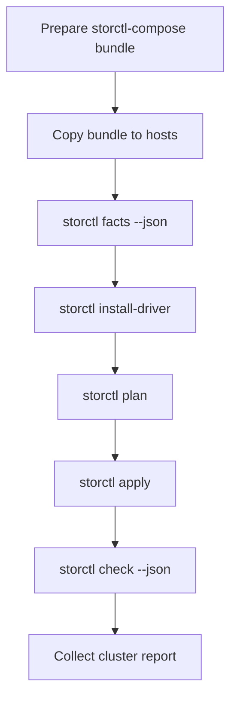

# storctl-compose

[English documentation](README.en.md)

`storctl-compose` 是 [`storctl`](https://github.com/vbhsjd/storctl) 的 Ansible 编排与离线 bundle companion。它负责把 `storctl` 二进制、profile、驱动清单、离线驱动目录和批量 playbook 组合起来，让多台实验室机器可以用同一套流程接入 NFS-RDMA 存储。

## 边界

`storctl-compose` 负责：

- 提供 Ansible playbook，批量执行 `storctl facts/plan/install-driver/apply/check`。
- 提供 profile、driver matrix、inventory 的公开示例。
- 构建离线 bundle，便于拷贝到无网实验室。
- 汇总每台机器的 `storctl check --json` 结果。

`storctl-compose` 不负责：

- 分发公开驱动包。
- 保存真实实验室 inventory、IP、账号或密钥。
- 替代 `storctl` 修改单机网络、挂载或驱动。
- 自研 SSH 编排器。

真实 CX7/1823 驱动包请放在内部 artifact 目录，公开仓库只保存格式、脚本和示例。

## 快速开始

准备控制机：

```bash
git clone https://github.com/vbhsjd/storctl-compose.git
cd storctl-compose
cp examples/inventory.ini inventory.ini
cp examples/storctl-profiles.json storctl-profiles.json
```

准备离线 bundle：

```bash
./scripts/build-bundle.sh \
  --storctl ./dist/storctl-linux-arm64 \
  --profiles ./storctl-profiles.json \
  --matrix ./examples/driver-matrix.yaml \
  --drivers ./drivers \
  --out ./bundles \
  --name c4-openeuler22-aarch64
```

批量执行：

```bash
ansible-playbook -i inventory.ini playbooks/10_copy_bundle.yml
ansible-playbook -i inventory.ini playbooks/20_install_driver.yml
ansible-playbook -i inventory.ini playbooks/30_plan.yml
ansible-playbook -i inventory.ini playbooks/40_apply.yml
ansible-playbook -i inventory.ini playbooks/50_check.yml
```

## 工作流



## Inventory 变量

每台机器至少需要：

```ini
node-1 ansible_host=192.0.2.11 storage_nic=enp23s0f1 nic_type=1823 storage_profile=c4
```

| Variable | Meaning |
| --- | --- |
| `storage_nic` | 明确指定的存储物理网卡 |
| `nic_type` | `cx7` 或 `1823` |
| `storage_profile` | `storctl-profiles.json` 中的 profile 名 |
| `storctl_artifact_dir` | 目标机驱动包目录，默认 `/root/storage_pkgs` |
| `storctl_remote_bin` | 目标机 `storctl` 路径，默认 `/usr/local/bin/storctl` |

## 安全原则

- 公开仓库不提交驱动包。
- 公开仓库不提交真实 inventory。
- 批量脚本依赖 `storctl check --json`，不 grep 人类可读输出。
- `storctl` 是单机命令；多机调度由 Ansible 完成。
